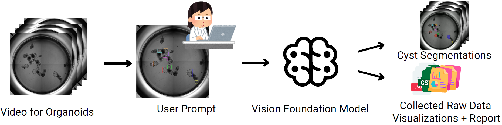
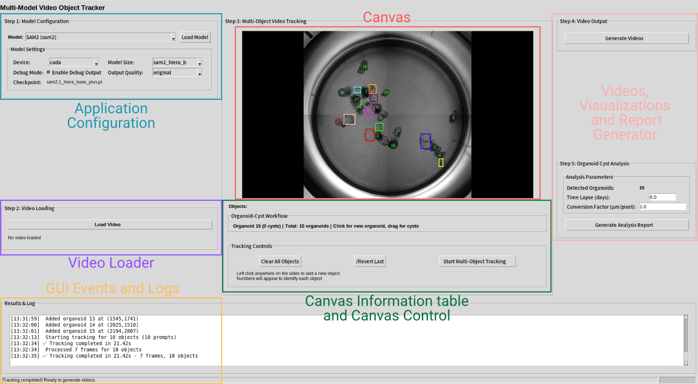
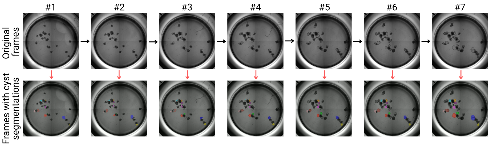
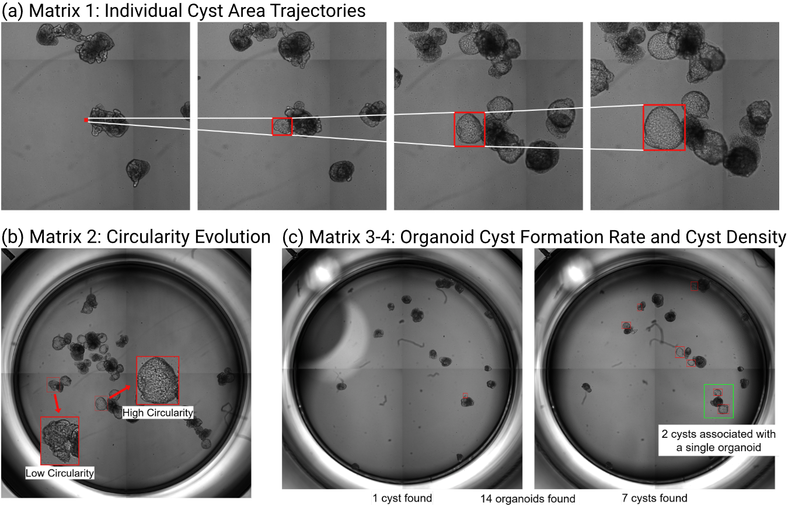
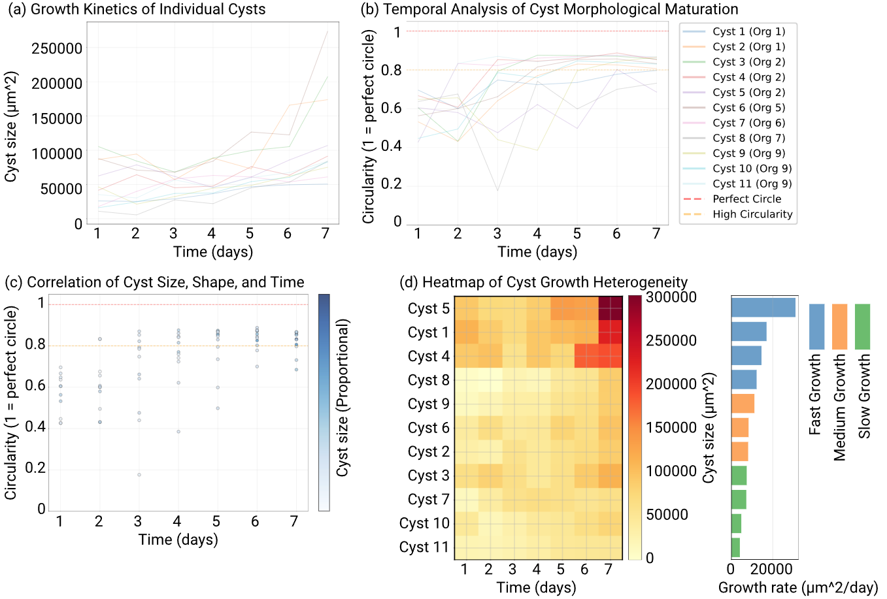

# Organoid Tracker: A SAM2-Powered Platform for Zero-shot Cyst Analysis in Human Kidney Organoid Videos

This is the official implementation of Organoid Tracker, a comprehensive AI-powered platform for automated kidney organoid cyst tracking and quantitative analysis. 

**Paper**
> [**Organoid Tracker: A SAM2-Powered Platform for Zero-shot Cyst Analysis in Human Kidney Organoid Videos**](#)  
> Xiaoyu Huang, Lauren M Maxson, Trang Nguyen, Cheng Jack Song, and Yuankai Huo  
> *arXiv ()*

Contact: [xiaoyu.huang@vanderbilt.edu](mailto:xiaoyu.huang@vanderbilt.edu). Feel free to reach out with any questions or discussion!

## Abstract



Quantitative analysis of kidney organoid cyst dynamics is crucial for understanding nephron development and disease mechanisms. Current approaches rely on manual annotation and specialized expertise, limiting scalability and reproducibility. We present Organoid Tracker, a user-friendly platform that leverages the Segment Anything Model 2 (SAM2) for zero-shot segmentation and automated tracking of cyst formation in time-lapse microscopy videos. Our platform introduces an innovative inverse temporal tracking workflow that improves accuracy by annotating the final, clearest frame and tracking backward in time. The system automatically extracts quantitative metrics including individual cyst growth kinetics, morphological maturation patterns, and population heterogeneity analysis, providing researchers with comprehensive analytical capabilities without requiring programming expertise.

## Highlights

- **Zero-Shot Learning**: No training data required - works immediately with SAM2's foundation model capabilities
- **Inverse Temporal Tracking**: Novel backward-in-time approach that leverages mature cyst morphology for improved accuracy  
- **Comprehensive Analytics**: Automated extraction of growth kinetics, morphological metrics, and population-level statistics
- **User-Friendly Interface**: Intuitive GUI designed specifically for biological researchers

## User Interface



The Organoid Tracker interface is organized into functional modules: (top-left) application configuration for model selection, (bottom-left) progress tracking log, (center) main canvas for video display and user interaction, and (right) analysis parameter input and report generation modules.

## Visual Results



Side-by-side comparison showing original time-lapse video frames (top row) with corresponding Organoid Tracker output (bottom row), where automatically generated segmentation masks with unique colors track individual cysts over time.

## Quantitative Metrics and Analysis Suite





**Key Measurements:**
- **(a) Cyst Area Tracking**: Cross-sectional area measurement across multiple time points
- **(b) Morphological Analysis**: Circularity comparison between irregular and well-defined cysts  
- **(c) Population Metrics**: Comprehensive organoid and cyst identification at initial and final time points
- **(d) Population-level Growth Heterogeneity**: Individual cyst growth rate analysis and temporal relationship visualization

Representative analysis output for a PKD mutant organoid video showing: **(a)** Cyst area trajectories with progressive growth, **(b)** morphological maturation tracking circularity evolution, **(c)** correlation visualization of size, shape, and temporal relationships, **(d)** population-level growth heterogeneity heatmap with individual cyst growth rates.

## Installation

### Prerequisites
- Python 3.9 or higher
- CUDA-compatible GPU
- 8GB RAM for video processing

### Quick Setup

```bash
# Clone the repository
git clone https://github.com/hrlblab/OrganoidTracker.git
cd OrganoidTracker

# Create and activate conda environment
conda create -n organoid-tracker python=3.9
conda activate organoid-tracker

# Install PyTorch with CUDA support (adjust CUDA version as needed)
pip install torch torchvision --index-url https://download.pytorch.org/whl/cu118

# Install remaining dependencies
pip install -r requirements.txt
```

### Model Checkpoints

Download the pre-trained SAM2 model weights:

```bash
# Create checkpoints directory
mkdir -p checkpoints

# Download SAM2 base model (recommended)
cd checkpoints
bash download_ckpts.sh

# Or manually download specific models:
# SAM2 Hiera Base Plus (recommended for most users)
wget -O sam2_hiera_base_plus.pt https://dl.fbaipublicfiles.com/segment_anything_2/092824/sam2_hiera_base_plus.pt

# SAM2 Hiera Large (for maximum accuracy)
wget -O sam2_hiera_large.pt https://dl.fbaipublicfiles.com/segment_anything_2/092824/sam2_hiera_large.pt
```

## Quick Start

### Basic Usage

1. **Launch the Application**
   ```bash
   python video_tracker_gui.py
   ```

2. **Load Your Video**
   - Click "Load Video" and select your time-lapse organoid video
   - Supported formats: MP4

3. **Configure Tracking**
   - Select SAM2 model variant (base/large)
   - Enable "Reverse Tracking" (recommended for organoid analysis)
   - Adjust confidence thresholds if needed

4. **Annotate Cysts**
   - Navigate to the final frame (clearest morphology)
   - Click and drag to create bounding boxes around cysts
   - Each cyst will be assigned a unique color

5. **Run Analysis**
   - Click "Start Tracking" to begin automated segmentation
   - Monitor progress in the log panel
   - Processing time varies with video length and model size

6. **Review Results**
   - Generated outputs saved to `data/output_videos/`
   - Includes tracking videos, analysis reports, and raw data


## Output Files

After analysis, the following files are generated in `data/output_videos/`:

- `multi_object_overlay.mp4` - Annotated tracking video
- `multi_object_mask.mp4` - Binary mask visualization  
- `multi_object_side_by_side.mp4` - Original and mask comparison
- `organoid_summary.csv` - Quantitative metrics data
- `organoid_analysis_report.pdf` - Publication-ready report
- `analysis_summary.json` - Complete session metadata
- `visualizations/` - Individual plots and figures

### Citation

If you find this work useful for your research, please cite our paper:

```bibtex
@article{huang2025organoid,
  title={Organoid Tracker: A SAM2-Powered Platform for Zero-shot Cyst Analysis in Human Kidney Organoid Videos},
  author={Huang, Xiaoyu and Maxson, Lauren M and Nguyen, Trang and Song, Cheng Jack and Huo, Yuankai},
  year={2025}
}
```

## Acknowledgments

This work builds upon the foundation of [Segment Anything Model 2 (SAM2)](https://github.com/facebookresearch/segment-anything-2) by Meta AI. We thank the authors for their groundbreaking contribution to computer vision and their open-source implementation.

## License

This project is licensed under the Apache-2.0 License. See the [LICENSE](LICENSE) file for details.