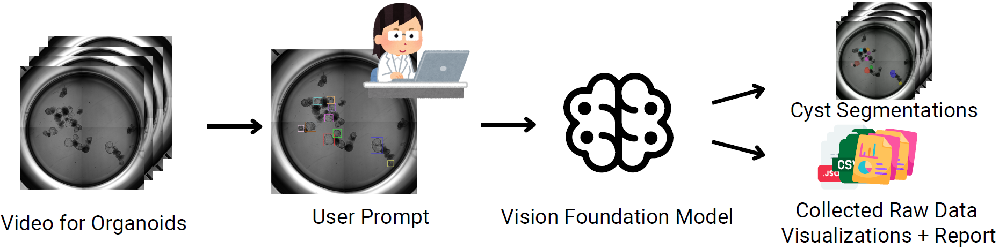
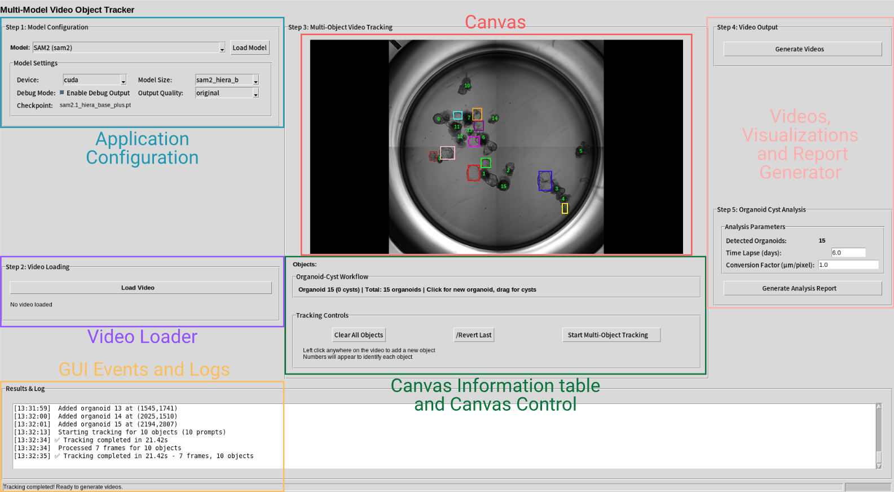
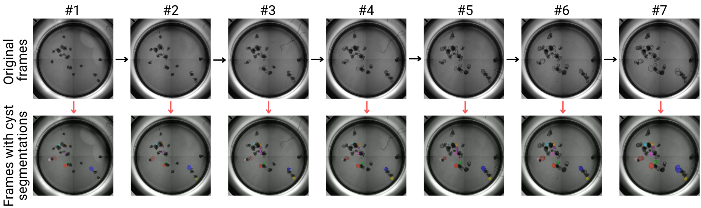
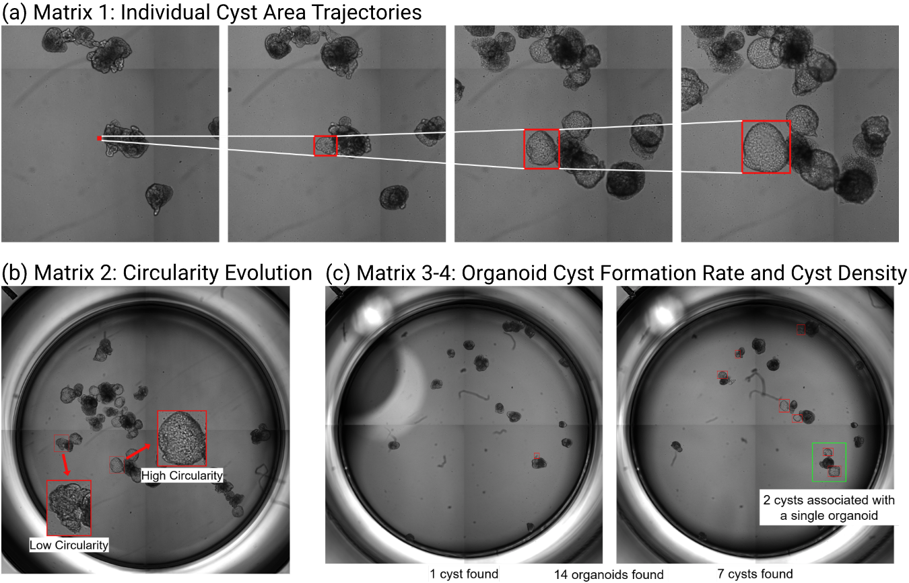
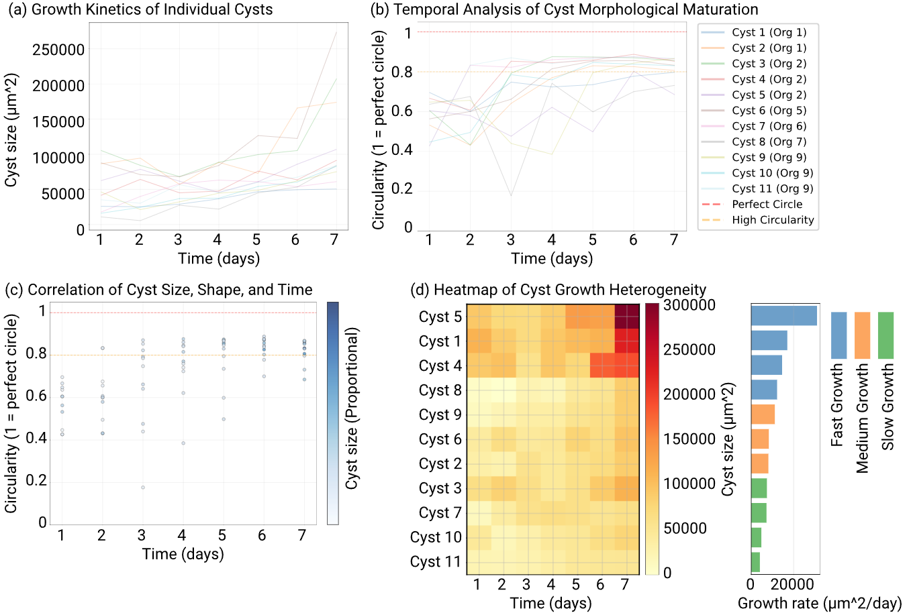

# Organoid Tracker: A SAM2-Powered Platform for Zero-shot Cyst Analysis in Human Kidney Organoid Videos

This is the official implementation of Organoid Tracker, a comprehensive AI-powered platform for automated kidney organoid cyst tracking and quantitative analysis.

**Paper**
> [**Organoid Tracker: A SAM2-Powered Platform for Zero-shot Cyst Analysis in Human Kidney Organoid Videos**](#)
> Xiaoyu Huang, Lauren M Maxson, Trang Nguyen, Cheng Jack Song, and Yuankai Huo
> *arXiv (2509.11063)*

Contact: [xiaoyu.huang@vanderbilt.edu](mailto:xiaoyu.huang@vanderbilt.edu). Feel free to reach out with any questions or discussion!

## Abstract



Quantitative analysis of kidney organoid cyst dynamics is crucial for understanding nephron development and disease mechanisms. Current approaches rely on manual annotation and specialized expertise, limiting scalability and reproducibility. We present Organoid Tracker, a user-friendly platform that leverages the Segment Anything Model 2 (SAM2) for zero-shot segmentation and automated tracking of cyst formation in time-lapse microscopy videos. Our platform introduces an innovative inverse temporal tracking workflow that improves accuracy by annotating the final, clearest frame and tracking backward in time. The system automatically extracts quantitative metrics including individual cyst growth kinetics, morphological maturation patterns, and population heterogeneity analysis, providing researchers with comprehensive analytical capabilities without requiring programming expertise.

## Highlights

- **Zero-Shot Learning**: No training data required - works immediately with SAM2's foundation model capabilities
- **Inverse Temporal Tracking**: Novel backward-in-time approach that leverages mature cyst morphology for improved accuracy
- **Comprehensive Analytics**: Automated extraction of growth kinetics, morphological metrics, and population-level statistics
- **User-Friendly Interface**: Intuitive GUI designed specifically for biological researchers

## User Interface



The Organoid Tracker interface is organized into functional modules: (top-left) application configuration for model selection, (bottom-left) progress tracking log, (center) main canvas for video display and user interaction, and (right) analysis parameter input and report generation modules.

## Visual Results



Side-by-side comparison showing original time-lapse video frames (top row) with corresponding Organoid Tracker output (bottom row), where automatically generated segmentation masks with unique colors track individual cysts over time.

## Quantitative Metrics and Analysis Suite





**Key Measurements:**
- **(a) Cyst Area Tracking**: Cross-sectional area measurement across multiple time points
- **(b) Morphological Analysis**: Circularity comparison between irregular and well-defined cysts
- **(c) Population Metrics**: Comprehensive organoid and cyst identification at initial and final time points
- **(d) Population-level Growth Heterogeneity**: Individual cyst growth rate analysis and temporal relationship visualization

Representative analysis output for a PKD mutant organoid video showing: **(a)** Cyst area trajectories with progressive growth, **(b)** morphological maturation tracking circularity evolution, **(c)** correlation visualization of size, shape, and temporal relationships, **(d)** population-level growth heterogeneity heatmap with individual cyst growth rates.

## Installation

### Prerequisites
- Python 3.12 or 3.13 and [uv](https://docs.astral.sh/uv/) (pip also works, see below)
- Linux or Windows. An NVIDIA GPU is strongly recommended: the CPU path works but is slow
- Tk for the desktop interface (included with the python.org and uv-managed interpreters; on Debian/Ubuntu install `python3-tk`)
- 8 GB+ RAM; 2 GB+ of GPU memory for the base-plus model on 4096 x 4096 videos

### Install with uv (recommended)

```bash
git clone https://github.com/hrlblab/OrganoidTracker.git
cd OrganoidTracker
uv sync --extra tk            # Linux: PyPI torch with CUDA 13; Windows: CPU torch
```

Pick the PyTorch build explicitly when needed:

```bash
uv sync --extra tk --extra cuda   # NVIDIA GPU on Windows or Linux (CUDA 13.0 wheels; driver 580 or newer)
uv sync --extra tk --extra cpu    # CPU only (smaller download)
```

`uv.lock` pins every dependency for Linux and Windows; `uv sync` creates `.venv` from it.

### Install with pip

```bash
python -m venv .venv
source .venv/bin/activate        # Windows: .venv\Scripts\activate
pip install -r requirements.txt  # exported from uv.lock
pip install -e .
# NVIDIA GPU on Windows: pip install torch torchvision --index-url https://download.pytorch.org/whl/cu130
```

### Verify the installation

```bash
uv run python -c "import torch, organoidtracker; print(torch.__version__, 'CUDA:', torch.cuda.is_available())"
```

### Model checkpoints

```bash
cd checkpoints
bash download_ckpts.sh        # SAM 2.1 (default); `bash download_ckpts.sh 2` for the original SAM 2 files
cd ..
```

The application looks for checkpoints in `./checkpoints` (or `ORGANOIDTRACKER_CHECKPOINTS`).

## Quick Start

### Basic Usage

1. **Launch the Application**
   ```bash
   uv run organoidtracker-tk
   ```
   (`python video_tracker_gui.py` inside the environment does the same.) Outputs, the prompt
   records and the log file (`data/output_videos/organoidtracker.log`) are written under `data/`
   in the directory you launch from.

2. **Load Your Video**
   - Click "Load Video" and select your time-lapse organoid video
   - Supported formats: MP4

3. **Configure Tracking**
   - Select the SAM2 model size (small, base-plus or large)
   - Keep "Reverse Tracking" enabled (recommended for organoid analysis)
   - Adjust confidence thresholds in `config.py` if needed

4. **Annotate Cysts**
   - With Reverse Tracking enabled the canvas shows the final frame of the video, where cysts are clearest
   - Left-click an organoid, then click and drag bounding boxes around its cysts; left-click again to start the next organoid
   - Each cyst is assigned a unique color
   - Repeated frames produced by video export are collapsed into single time points; the log shows the decoded and unique frame counts

5. **Run Analysis**
   - Click "Start Tracking" to begin automated segmentation
   - Monitor progress in the log panel
   - Processing time varies with video length and model size

6. **Review Results**
   - Generated outputs saved to `data/output_videos/`
   - Includes tracking videos, analysis reports, and raw data


## Output Files

After analysis, the following files are generated in `data/output_videos/`:

- `multi_object_overlay.mp4` - Annotated tracking video
- `multi_object_mask.mp4` - Binary mask visualization
- `multi_object_side_by_side.mp4` - Original and mask comparison
- `organoid_summary.csv` - Quantitative metrics data
- `organoid_analysis_report.pdf` - Publication-ready report
- `analysis_summary.json` - Complete session metadata
- `visualizations/` - Individual plots and figures
- `prompts/<video>_<timestamp>.json` - Prompts, organoid associations and provenance of each tracking run

### Frame order and timing

Frames are handled in chronological order throughout. With Reverse Tracking enabled, prompts are placed on the last frame and SAM2 propagates backwards in time; outputs are always written chronologically. The "Time Lapse (days)" value is the span from the first to the last frame, and days are numbered from 1 as in the paper's figures (seven daily frames spanning six days are days 1 to 7).

### Running the tests

```bash
uv run pytest                      # unit tests; model tests run when checkpoints/sam2.1_hiera_tiny.pt exists
uv run pytest -m gui               # opens and closes the main window (needs a display)
uv run ruff check && uv run ruff format --check
```

The suite uses synthetic videos only; the same checks run in GitHub Actions on Linux and Windows.
Install the pre-commit hooks with `uv run pre-commit install`.

### Citation

If you find this work useful for your research, please cite our paper:

```bibtex
@article{huang2025organoid,
  title={Organoid Tracker: A SAM2-Powered Platform for Zero-shot Cyst Analysis in Human Kidney Organoid Videos},
  author={Huang, Xiaoyu and Maxson, Lauren M and Nguyen, Trang and Song, Cheng Jack and Huo, Yuankai},
  journal={arXiv preprint arXiv:2509.11063},
  year={2025},
  doi={10.48550/arXiv.2509.11063}
}
```

The same metadata is in [CITATION.cff](CITATION.cff).

## Acknowledgments

This work builds upon the foundation of [Segment Anything Model 2 (SAM2)](https://github.com/facebookresearch/segment-anything-2) by Meta AI. We thank the authors for their groundbreaking contribution to computer vision and their open-source implementation.

## License

This project is licensed under the Apache-2.0 License. See the [LICENSE](LICENSE) file for details.
Third-party notices, including for the vendored SAM 2 code under `src/sam2`, are in [NOTICE](NOTICE).
